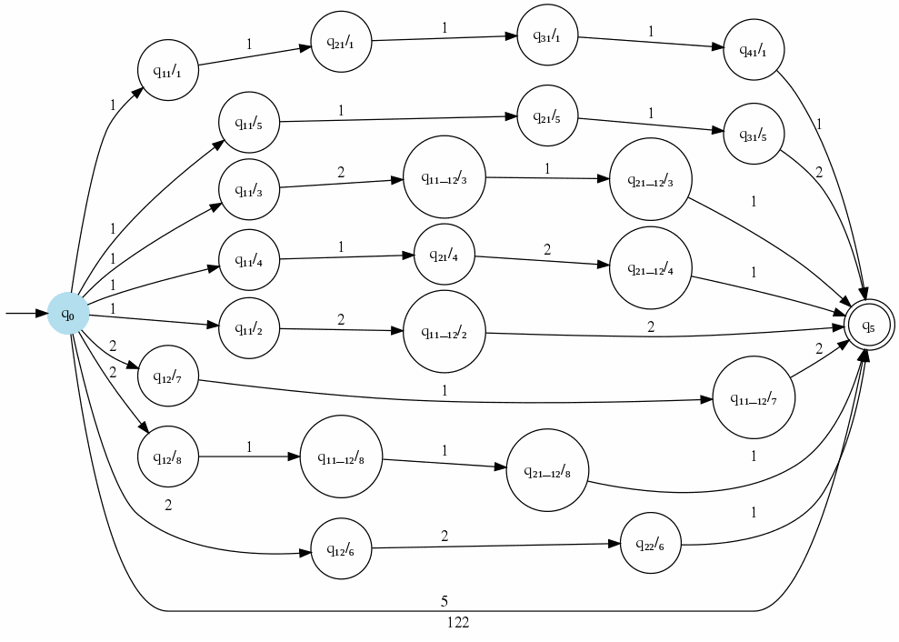
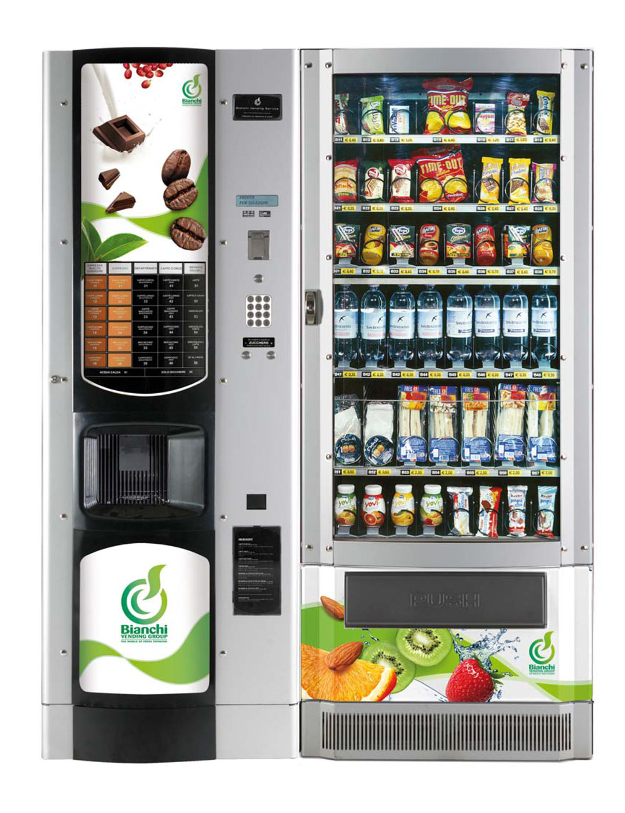

### Funcionamiento de la Máquina Dispensadora de Sodas con un AFD

#### 1. Estados del AFD:

La máquina tiene diferentes estados que representan su estado interno en un momento dado. Por ejemplo:
- **Estado Inicial (q0)**: La máquina está lista para recibir una solicitud de soda.
- **Estado de Selección de Producto (q1)**: La máquina ha recibido el pago y está esperando que el usuario seleccione el tipo de soda.
- **Estado de Dispensación (q2)**: La máquina está dispensando la soda.
- **Estado de Espera (q3)**: La máquina está esperando que el usuario retire la soda.
- **Estado de Error (qe)**: Representa un estado de error en caso de que se presente una situación inesperada.

#### 2. Transiciones entre Estados:

- **Pago y Selección de Producto**: Cuando un usuario introduce el dinero necesario, la máquina pasa del estado inicial (q0) al estado de selección de producto (q1). Aquí, el usuario elige el tipo de soda que desea.
  
- **Dispensación**: Una vez que el usuario ha seleccionado su producto, la máquina pasa al estado de dispensación (q2). En este estado, la máquina libera la soda seleccionada.
  
- **Espera y Retiro del Producto**: Después de dispensar la soda, la máquina pasa al estado de espera (q3), donde espera a que el usuario retire su producto. Una vez que el usuario retira la soda, la máquina vuelve al estado inicial (q0) y está lista para la próxima solicitud.

- **Manejo de Errores**: Si en algún momento ocurre un problema, como falta de cambio o un problema mecánico, la máquina puede pasar al estado de error (qe) y mostrar un mensaje de error al usuario.

#### 3. Implementación Física:

Físicamente, los estados del AFD pueden estar representados por luces LED o pantallas que indican el estado actual de la máquina (por ejemplo, "Listo", "Seleccionar Producto", "Dispensando", "Espere", "Error"). Los botones de selección y los mecanismos de dispensación interactúan con el AFD para cambiar de estado según las acciones del usuario.

#### 4. Ejemplo de Flujo:

1. **Inicio**: La máquina está en el estado inicial (q0).
  
2. **Pago y Selección de Producto**: El usuario introduce el dinero requerido. La máquina pasa al estado de selección de producto (q1).
  
3. **Selección de Producto**: El usuario elige su soda favorita. La máquina pasa al estado de dispensación (q2).
  
4. **Dispensación**: La máquina dispensa la soda seleccionada. Pasa al estado de espera (q3).
  
5. **Retiro del Producto**: El usuario retira la soda. La máquina vuelve al estado inicial (q0).

#### 5. Ventajas de Utilizar un AFD:

- **Determinismo**: La máquina sigue un flujo de estados predefinido, lo que garantiza un comportamiento predecible y confiable.
  
- **Facilidad de Mantenimiento**: Al modelar la máquina con un AFD, se facilita la identificación y resolución de problemas, ya que el comportamiento de la máquina está claramente definido por sus estados y transiciones.

- **Escalabilidad**: Se pueden agregar fácilmente nuevos estados y funcionalidades a la máquina sin modificar su estructura fundamental, lo que permite adaptarse a diferentes contextos y requerimientos.

En resumen, un autómata finito determinista proporciona un marco claro y estructurado para el diseño y funcionamiento de una máquina dispensadora de sodas, garantizando una experiencia de usuario coherente y confiable.

